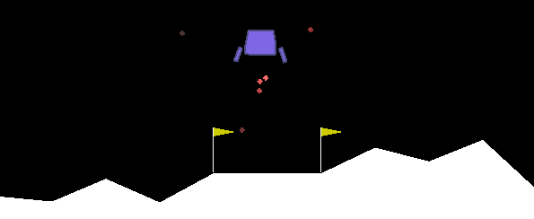

# Lunar Lander
---

Surprise your colleagues working on DQN by learning to land on moon in under 4 minutes using only 32 weights.

## Usage
---
Run `land.py` to land on Moon!

Run `sga_train.py` to train a new agent.

See [notes](#Notes-for-Windows-Users) if having problems with PyBox2D.

## Agents
---

Gradient Monte Carlo, Semi Gradient and Episodic Semi Gradient agents can be found in `agent.py`.

### Gradient Monte Carlo (GMC)
A GMC [[1]] agent implementation for solving Lunar Landing task.

Gradient Monte Carlo algorithm works on the basis of SGD, sampling states and rewards from an environment using provided policy and updating a differentiable value-approximation function at the end of sequence.

Weight update is performed separately for each state-action tuple, rather than accumulating the gradient over all sequence.

## Notes for Windows Users

If having problems installing PyBox2D using pip, download the wheel from [here](https://www.lfd.uci.edu/~gohlke/pythonlibs/#pybox2d)
and install the package using `pip install [wheel filename]`.

## References
---

[1]: url "Sutton, R. S., Barto, A. G.  (20181019). Reinforcement Learning: An Introduction."

1. "Sutton, R. S., Barto, A. G.  (20181019). Reinforcement Learning: An Introduction."
